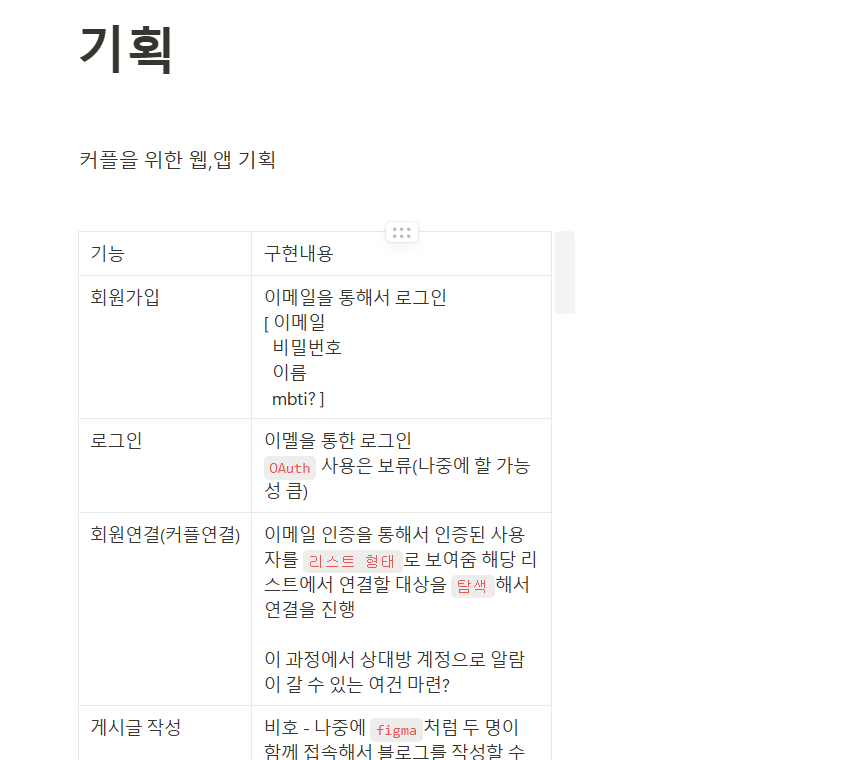
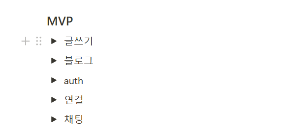
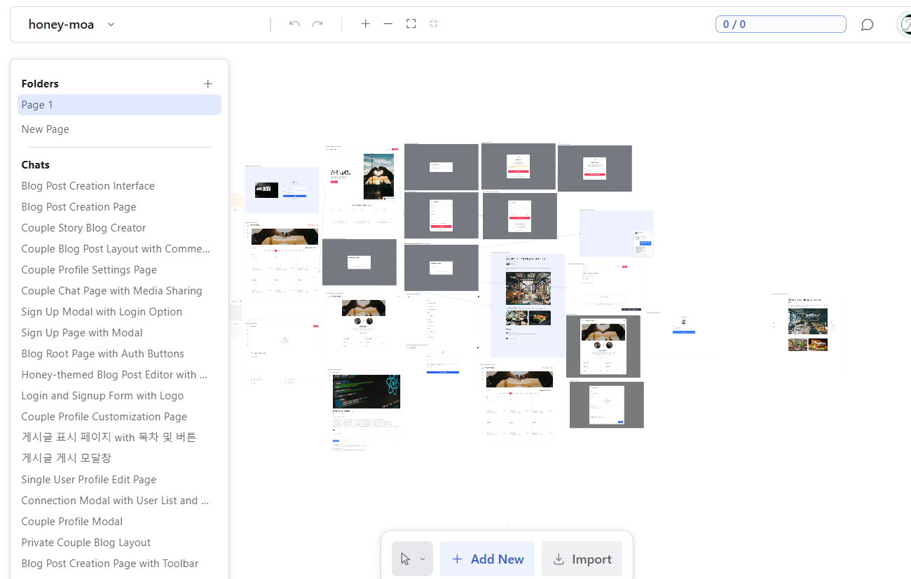
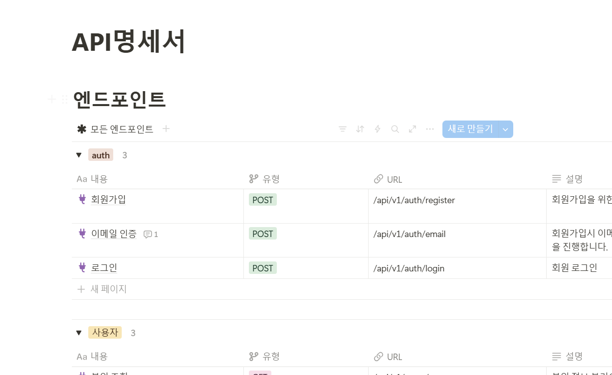
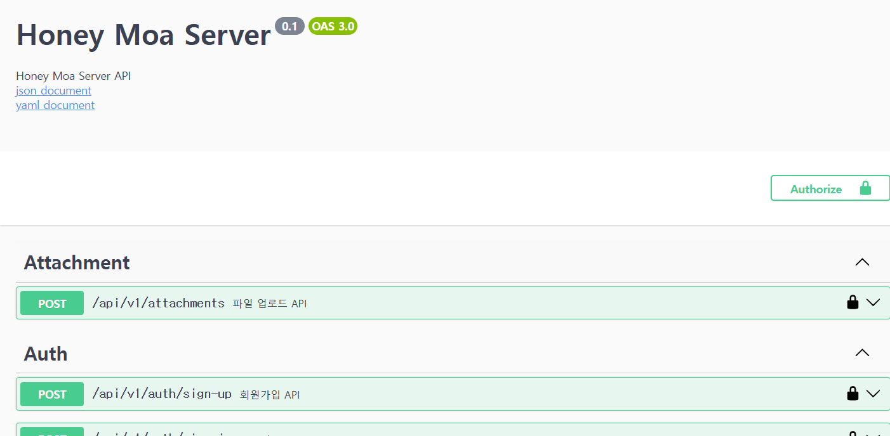
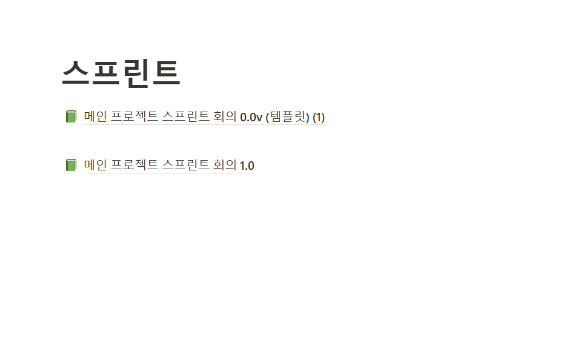

## 협업 방식

### 기획

|                          |                          |
| ------------------------ | ------------------------ |
|  |  |

MVP모델 기획, 일정에 맞게 MVP모델 을 구축을 목표로 진행

### 디자인

magic pattern 생성형 AI를 사용해, 웹사이트를 디자인

### 협업

- 노션을 통한 API문서화
  

- 디스코드를 통한 온라인 회의 진행
  

- 스웨거 문서를 통한 API문서 고도화
  

- MVP 이후 2주에 한 번 스프린트 정기 회의 진행
  
